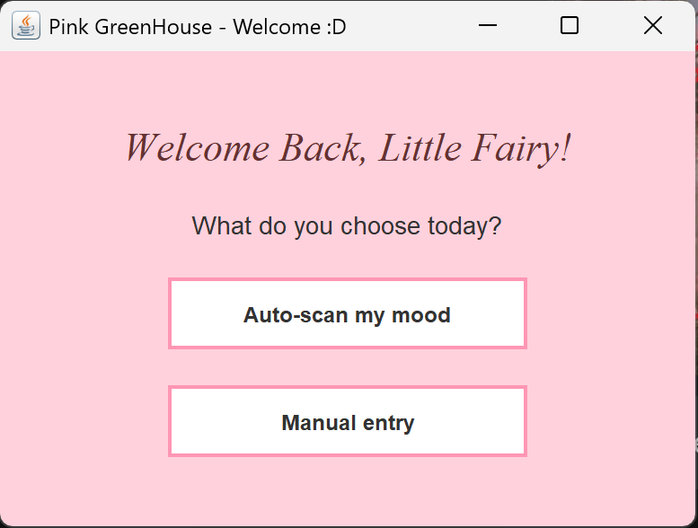

# Pink GreenHouse – Mood & Growth Tracker

## Description
*Pink GreenHouse* is a personalized tool designed to monitor emotional well-being and personal growth, inspired by the idea of a "sacred garden" or a safe space. The application allows users to track their daily moods using symbolic colors (Pink for achievements and Green for growth) and keep a digital journal of thoughts or verses that provide light during darker times.

The project's highlight will be an AI Face Scanner that automatically detects the user's emotion to suggest a mood entry, blending technology with self-care.

## Features
- Data Persistence: All entries are saved locally in a structured format.

## Used Technologies
- Java (Logic & File I/O)
- IntelliJ IDEA + Maven
- Swing / JavaFX (GUI)
- Sarxos Webcam API (Hardware integration)

## How to Run 
1. Clone the repository:    
bash
   git clone https://github.com/SabeCiupi/MoodGrowthTracker.git
2. Open the project in IntelliJ IDEA.
3. Make sure to Reload Maven Project to download the necessary dependencies (Webcam API).
4. Run the Main class.

---

## Development Log
| Update Description  | Release Date  | 
|---------------------------------------------------------------------------------------------------------------------------------------------|---------------|
| 1. Initialized the project structure. Created the MoodEntry class to store data (date, color, quote, and joy score). Set up the Main class with a basic console output to verify object creation.  2. Implemented the MoodManager class using BufferedWriter and FileWriter. The app can now save mood entries into a local mood_entries.txt file, ensuring progress is kept after closing the app.  3. Integrated java.time to automatically fetch the current date. Customized the DateTimeFormatter with Locale.ENGLISH to display dates in a "Day Month Year" format (e.g., 22 February 2026).  4. Converted the project to Maven and added the Sarxos Webcam API dependency. Successfully implemented a webcam test that detects the camera, sets a 640x480 resolution, and triggers the hardware.  5. Created the first graphical interface (WelcomeWindow) using Java Swing. Designed a pastel-themed welcome screen with two main paths: "Auto-scan my mood" and "Manual entry". | February 22, 2026 |

## Development Demos 

### February 22, 2026 — Welcome Page

